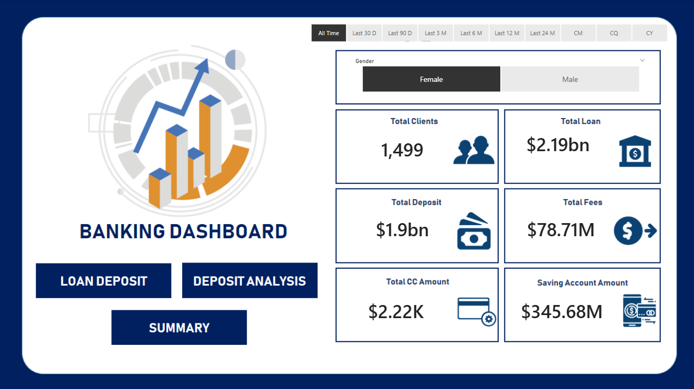
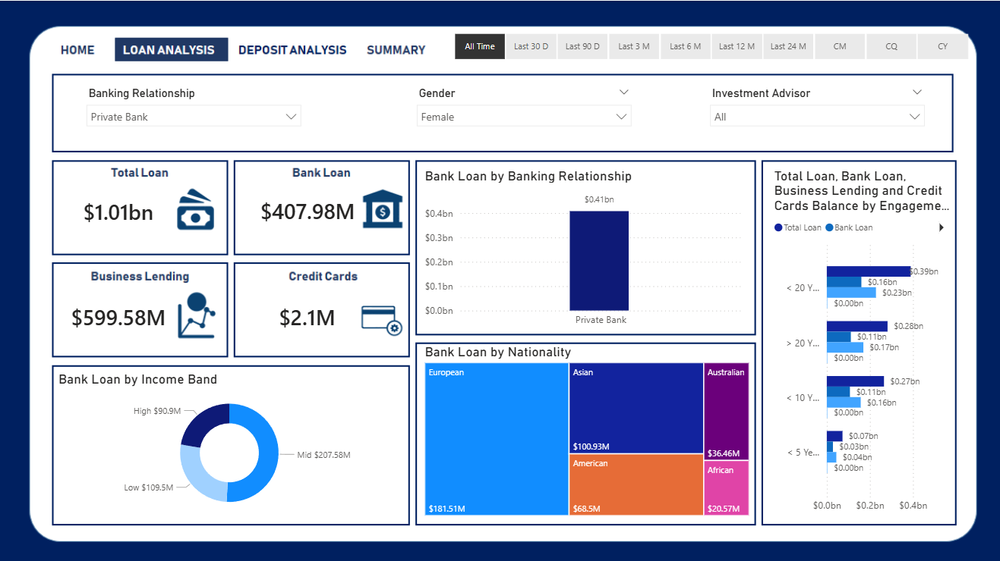
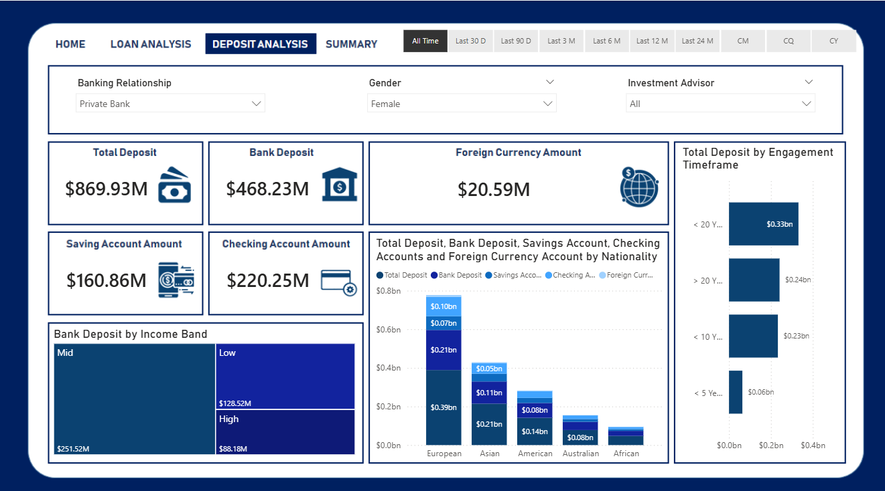
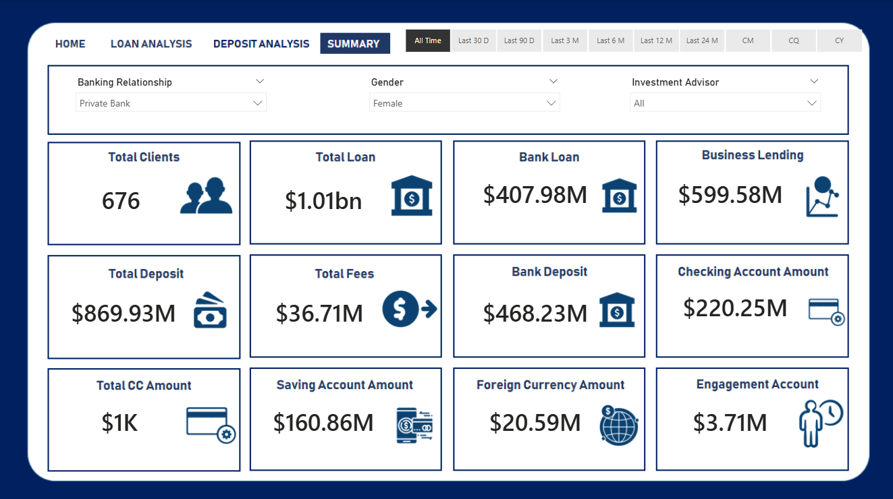

# 📊 Banking & Investment Analytics Dashboard

## 📌 Overview
This project demonstrates advanced **data analytics and dashboard development** using **Power BI** and structured banking datasets.  
The goal is to **decode complex data patterns**, minimize lending risks, and provide actionable insights for financial decision-making.

## 🎯 Objective
- Analyze large, interconnected datasets to identify trends and risk factors.  
- Build dashboards that empower stakeholders to make informed lending and investment decisions.  
- Ensure data integrity, create predictive models, and support compliance with financial policies.  

## 📊 Dataset Structure
- **Banking Relationship** – Retail, Institutional, Private Bank, Commercial  
- **Client-Banking** – Deposits, loans, fees, engagement duration  
- **Gender** – Male/Female classification  
- **Investment Advisor** – Advisor-client mapping  
- **Period** – Engagement timeline  

## 🧹 Data Cleaning & Transformation
- Created **Engagement Timeframe** and **Engagement Days** columns.  
- Binned **Estimated Income** into **Low (<100k)** and **Mid (<300k)** income bands.  
- Derived **Processing Fees** from **Fee Structure**.  
- Ensured **data quality and integrity** through validation and cleansing.  

## 🧮 DAX Calculations
- `SUM`, `SUMX`, `DISTINCTCOUNT`, `SWITCH`, `DATEDIFF`  
- Examples:  
  - `Total Loan = [Bank Loan] + [Business Lending] + [Credit Cards Balance]`  
  - `Engagement Days = DATEDIFF([Joined Bank], TODAY(), DAY)`  

## 📈 Key KPIs
- **Total Clients**  
- **Total Loan** (Bank Loan + Business Lending + Credit Card Balance)  
- **Total Deposit** (Bank Deposit + Savings + Foreign Currency + Checking)  
- **Total Fees**  
- **Engagement Account**  
- **Credit Card Balance**  

## 📊 Dashboard Screenshots
### 🔹 Banking Overview

### 🔹 Loan Analysis

### 🔹 Deposit Analysis

### 🔹 Summary Dashboard

> Replace `images/*.png` with actual paths in your repo.

## 🔍 Insights
- Loans are **highest in Mid Income Band**, lowest in High Income Band.  
- **European clients** dominate both loan and deposit volumes.  
- **Private Banks** attract the most clients.  
- **Jade loyalty tier** contributes the highest fees.  

## 🛠 Tools & Skills Demonstrated
- **Power BI** – Dashboard creation & KPI visualization  
- **SQL / Excel / CSV** – Data preprocessing & query writing  
- **Python/R** – Exploratory analysis & statistical modeling (optional extensions)  
- **DAX Functions** – Advanced calculations  
- **Data Quality Checks** – Validation & cleansing  

## 🚀 Role Alignment
This project reflects the responsibilities of a **Senior Data Analyst / Data Operations Associate**:  
- Collect, process, and analyze large datasets.  
- Develop dashboards and reports to support decision-making.  
- Collaborate with stakeholders to translate business needs into data-driven solutions.  
- Conduct exploratory analysis to uncover growth opportunities.  
- Implement predictive analytics and maintain data integrity.  
- Present findings clearly to both technical and non-technical audiences.  

---

📂 **Project Files**
- `Banking Report.docx` – Documentation  
- `Banking.pptx` – Presentation deck  
- `*.csv` – Source datasets  
- `*.png` – Dashboard screenshots  

Created By Chaitanya Kukwas
